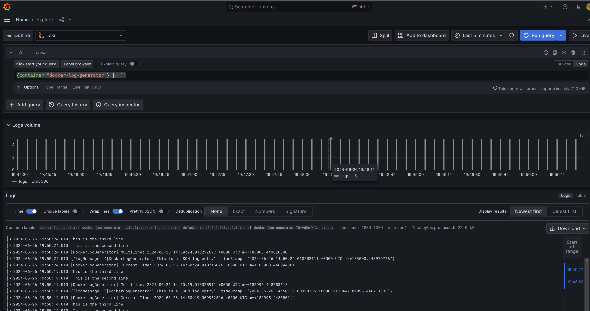

# Centralize Logging with Grafana Loki
Reference to my [Medium Blog](https://akbaralam.medium.com/cloud-native-logging-system-with-grafana-loki-29d8013b472c).

## Setting up loki in kubernetes (AWS EKS)
I will install loki, deploy an application and perform all the log collection process.

## Prerequisites:
1. Kubernetes Cluster
2. kubectl CLI tool to interact with cluster
3. helm

## Adding Required Helm Repos
To install loki, Add kube prometheus stack and grafana helm charts onto the local Helm registry and update the charts.

```bash
## kube-prometheus-stack
helm repo add prometheus-community https://prometheus-community.github.io/helm-charts

## grafana
helm repo add grafana https://grafana.github.io/helm-charts

# Update charts
helm repo update

# Create monitoring namespace to deploy all logging and monitoring related components in this namespace
kubectl create namespace monitoring

```
## Installing Kube-Prometheus-stack
We will install kube-prometheus-stack helm chart, this will install grafana and prometheus.

Create a kube prometheus config file. Add the below values which will be passed to kube-prometheus-stack helm chart as values file.

The ‘prometheus-config.yaml’ value has configuration to add loki as datasource in grafana.

```bash
#prometheus-config.yaml

prometheus:
  prometheusSpec:
    serviceMonitorSelectorNilUsesHelmValues: false
    serviceMonitorSelector: {}
    serviceMonitorNamespaceSelector: {}

grafana:
  sidecar:
    datasources:
      defaultDatasourceEnabled: true
  additionalDataSources:
    - name: Loki
      type: loki
      url: http://loki-loki-distributed-query-frontend.monitoring:3100 
```

```bash
## install kube-prometheus-stack
helm upgrade --install prom-stack prometheus-community/kube-prometheus-stack --values prometheus-config.yaml -n monitoring

```

## Installing Promtail
While installing promtail create “promtail-values.yaml” which contains configuration related to promtail, it needs to know the loki endpoint where it will push all the logs.

```bash
#promtail-values.yaml

config:
  serverPort: 8080
  clients:
    - url: http://loki-loki-distributed-gateway/loki/api/v1/push   #http://<loki-url>/loki/api/v1/push

```

```bash
## Install promtail logging agent

helm upgrade --install promtail grafana/promtail --values promtail-values.yaml -n monitoring

```

## Installing Loki
Install loki using the grafana helm chart. This will deploy loki in a microservice mode where each component of loki is deployed as independent services.

```bash
## Install loki 
helm upgrade --install loki grafana/loki-distributed -n monitoring

```

After successfully deploying loki and it’s supporting component. Access the grafana dashboard by using port forwarding using the commands below. Grafana dashboard can be accessible on http://localhost:8080


**Grafana Credentials**
user: admin
pass: prom-operator


```bash
#list services in monitoring namespace
kubectl get svc -n monitoring


#Port-forward to access the grafana dashboard
#replace the prom-stack-grafana with your grafana service name
 
kubectl port-forward svc/prom-stack-grafana 8080:80 -n monitoring

```

## Deploying Logging Application & Logs in Grafana Dashboard
After setting loki, you need to deploy an application which will generate logs then you can run the log query on the grafana dashboard. Here’s a sample kubernetes deployment file of our logger application.

```bash
#logger-deploy.yaml

apiVersion: apps/v1
kind: Deployment
metadata:
  name: docker-log-generator
  labels:
    app: docker-log-generator
spec:
  selector:
    matchLabels:
      app: docker-log-generator
  replicas: 1
  template:
    metadata:
      labels:
        app: docker-log-generator
    spec:
      containers:
      - name: docker-log-generator
        imagePullPolicy: Always
        image: coffeeapplied/dockerloggenerator:1.0.2
        resources:
          requests:
            cpu: 50m
            memory: 50Mi
          limits:
            cpu: 100m
            memory: 100Mi

```

In the grafana dashboard
1. Select explore from the left menu.
2. In Outline select loki as datasource.
3. To qurey log data filters (container=container-name), (container=docker-log-generator) and the log query will be {container=”docker-log-generator”} |= ``
4. The log query will print out all the logs related the docker-log-generator pod. Explore more queries and analyze log data.

