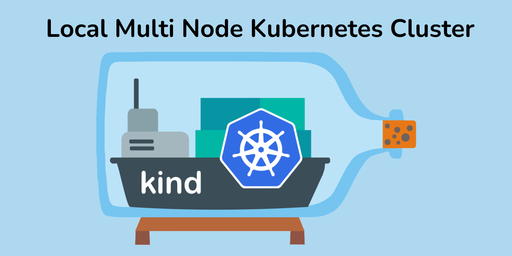

## Spin Up Multi Node Cluster Using Docker Containers, kind Cluster!



Do you want to test your application locally before taking the big step to the cloud? I have a tool for you called kind. It is a lightweight, Docker based Kubernetes cluster, and the best part is that it supports multi-node setups

### Installation
Go to the release page of kind, copy the latest release version and replace the value of release_version variable.
**NOTE: I will install this on an Ubuntu 23.10 Linux machine**

```bash
release_version=v0.22.0
[ $(uname -m) = x86_64 ] && curl -Lo ./kind https://kind.sigs.k8s.io/dl/${release_version}/kind-linux-amd64
chmod +x ./kind
sudo mv ./kind /usr/local/bin/kind
```

After running the script, you can check if the installation was successful by checking the kind version.

```bash
kind --version
```

### Cluster Setup
To set up your kind cluster, there are two main ways you can create your cluster.
* Using CLI
* YAML Config File

### Using CLI (Single Node)
The simplest way to create a cluster is by using the kind create cluster command, which will spin up a single control plane node.

```bash
akbar@akbar-xps-15-7590:~$ kind create cluster --name kube-local
Creating cluster "kube-local" ...
 ✓ Ensuring node image (kindest/node:v1.29.2) 🖼
 ✓ Preparing nodes 📦  
 ✓ Writing configuration 📜 
 ✓ Starting control-plane 🕹️ 
 ✓ Installing CNI 🔌 
 ✓ Installing StorageClass 💾 
Set kubectl context to "kind-kube-local"
You can now use your cluster with:

kubectl cluster-info --context kind-kube-local

Have a nice day! 👋Here's the 'kind create cluster' is the command and we're passing the name flag to assign a name of the cluster.
```

### Using YAML config file
if you want to spin up a cluster with custom configuration, including the latest or older versions and a multi-node cluster, you need to define a YAML configuration file.

Here's a sample configuration file. This config file will spin up a cluster with one control plane node and two worker nodes.

```bash

#kind_config.yaml

kind: Cluster
apiVersion: kind.x-k8s.io/v1alpha4
name: local
nodes:
- role: control-plane
  image: kindest/node:v1.29.1@sha256:0c06baa545c3bb3fbd4828eb49b8b805f6788e18ce67bff34706ffa91866558b
- role: worker
  image: kindest/node:v1.29.1@sha256:0c06baa545c3bb3fbd4828eb49b8b805f6788e18ce67bff34706ffa91866558b
- role: worker
  image: kindest/node:v1.29.1@sha256:0c06baa545c3bb3fbd4828eb49b8b805f6788e18ce67bff34706ffa91866558b
```

Run the following command to create a cluster from the configuration file:

```bash
kind create cluster --config kind_config.yaml
```

```bash
akbar@akbar-xps-15-7590:~$ kind create cluster --config kind_config.yaml
Creating cluster "local" ...
 ✓ Ensuring node image (kindest/node:v1.29.1) 🖼
 ✓ Preparing nodes 📦 📦 📦  
 ✓ Writing configuration 📜 
 ✓ Starting control-plane 🕹️ 
 ✓ Installing CNI 🔌 
 ✓ Installing StorageClass 💾 
 ✓ Joining worker nodes 🚜 
Set kubectl context to "kind-local"
You can now use your cluster with:

kubectl cluster-info --context kind-local

Have a question, bug, or feature request? Let us know! https://kind.sigs.k8s.io/#community 🙂
```

I'm using the latest Kubernetes version. You can use any image version according to your requirements. A list of available image versions can be found on the release page.

Once the cluster is ready, we can check the cluster information and get the status of our nodes.

```bash
akbar@akbar-xps-15-7590:~$ kubectl cluster-info --context kind-local
Kubernetes control plane is running at https://127.0.0.1:39703
CoreDNS is running at https://127.0.0.1:39703/api/v1/namespaces/kube-system/services/kube-dns:dns/proxy

To further debug and diagnose cluster problems, use 'kubectl cluster-info dump'.
```

Check the status of nodes.

```bash
akbar@akbar-xps-15-7590:~$ kubectl get nodes -o wide
NAME                  STATUS   ROLES           AGE     VERSION   INTERNAL-IP   EXTERNAL-IP   OS-IMAGE                         KERNEL-VERSION     CONTAINER-RUNTIME
local-control-plane   Ready    control-plane   5m51s   v1.29.1   172.18.0.3    <none>        Debian GNU/Linux 12 (bookworm)   6.5.0-28-generic   containerd://1.7.13
local-worker          Ready    <none>          5m34s   v1.29.1   172.18.0.4    <none>        Debian GNU/Linux 12 (bookworm)   6.5.0-28-generic   containerd://1.7.13
local-worker2         Ready    <none>          5m33s   v1.29.1   172.18.0.2    <none>        Debian GNU/Linux 12 (bookworm)   6.5.0-28-generic   containerd://1.7.13
```


## Running nginx pod
Now that we have the cluster up and running, we can test our cluster setup by running an Nginx pod to check if everything is working correctly.

The following command will create an Nginx pod in the default namespace:
```bash
akbar@akbar-xps-15-7590:~$ kubectl run nginx --image nginx
pod/nginx created
```

List the pods in the default namespace to confirm that our Nginx pod is running successfully.

```bash
akbar@akbar-xps-15-7590:~$ kubectl get pods -o wide
NAME    READY   STATUS    RESTARTS   AGE   IP           NODE            NOMINATED NODE   READINESS GATES
nginx   1/1     Running   0          90s   10.244.2.2   local-worker2   <none>           <none>
```

To access the Nginx pod running on the kind cluster, we need to perform local port forwarding.

```bash
akbar@akbar-xps-15-7590:~$ kubectl port-forward nginx 8080:80
Forwarding from 127.0.0.1:8080 -> 80
Forwarding from [::1]:8080 -> 80
Handling connection for 8080
Handling connection for 8080
```

Visit http://localhost:8080 in your browser to see the Nginx welcome page


## Clean Up
To delete the cluster, first list all the available clusters. We have a single kind cluster named 'local'.
```bash
akbar@akbar-xps-15-7590:~$ kind get clusters
local
```

To delete the 'local' cluster, run the command below

```bash
akbar@akbar-xps-15-7590:~$ kind delete cluster --name local
Deleting cluster "local" ...
Deleted nodes: ["local-control-plane" "local-worker2" "local-worker"]
```

Now that you're set up, the world of Kubernetes is at your fingertips - let the adventure begin!